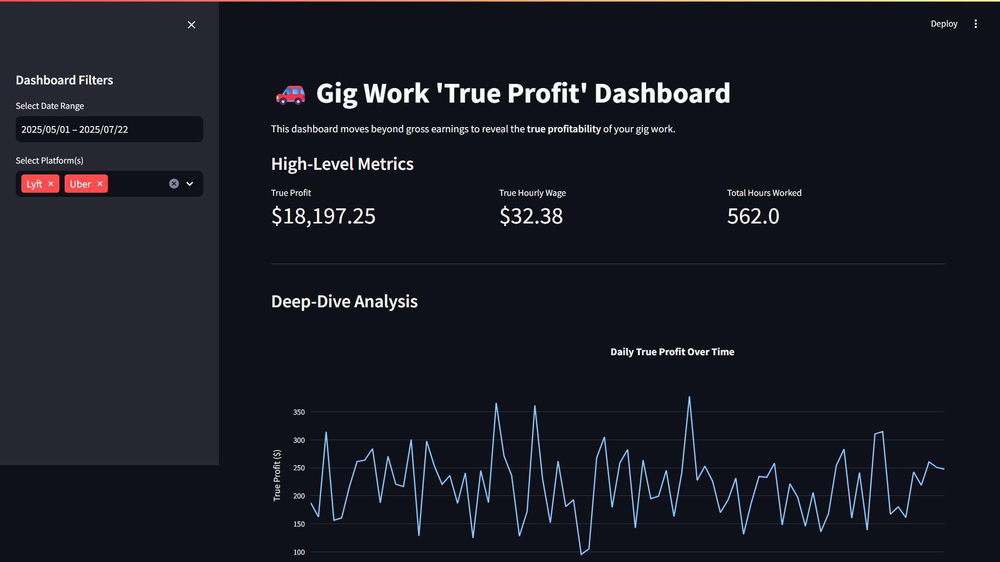

🚗 Gig Work 'True Profit' Dashboard
This project provides a comprehensive dashboard for analyzing the profitability of gig work, specifically for ride-sharing platforms like Uber and Lyft. It moves beyond simple gross earnings to calculate a "true profit" by factoring in platform commissions, fuel costs, and vehicle maintenance.
The dashboard is built with Streamlit and uses Plotly for interactive visualizations, allowing users to filter their trip data and gain deeper insights into their financial performance. The project also includes a script to generate realistic, synthetic data, so you can run and test the dashboard immediately.

 ✨ Features
•	True Profit Calculation: Automatically calculates net earnings, vehicle costs, and true profit for each trip.
•	Interactive KPIs: Key Performance Indicators (KPIs) like Total True Profit, True Hourly Wage, and Total Hours Worked update dynamically based on your filters.
•	Dynamic Filtering: Filter the dataset by a specific date range or by platform (Uber, Lyft, or both).
•	Insightful Visualizations:
o	Daily True Profit Over Time: A line chart to track profitability trends.
o	Breakdown of Gross Earnings: A pie chart that visualizes the proportion of your earnings that go to platform fees, vehicle costs, and actual profit.
o	Platform Performance: A bar chart comparing the average true hourly wage between different platforms.
•	Data Generation: Includes a Python script (generate_data.py) to create a sample gig_work_data.csv file with 1000 simulated trips.
•	Raw Data Explorer: An expandable section to view the filtered data in a table format.
⚙️ How It Works
The project consists of two main Python scripts:
1.	generate_data.py: This script creates a synthetic dataset (gig_work_data.csv) of ride-sharing trips. It simulates trip details like duration, distance, and platform. Using pre-defined cost factors (fuel, maintenance, platform commissions), it calculates various financial metrics, including platform_fees, vehicle_costs, and the final true_profit.
2.	app.py: This is the main Streamlit application. It loads the data from the CSV file, creates a user interface with sidebar filters, processes the data based on user input, and displays the KPIs and interactive charts.
🚀 Getting Started
Follow these instructions to get the dashboard running on your local machine.
Prerequisites
•	Python 3.8 or newer
•	pip (Python package installer)
1. Clone the Repository
Clone this project to your local machine.
git clone <your-repository-url>
cd <repository-directory>
2. Create a Virtual Environment (Recommended)
It's a best practice to create a virtual environment to keep project dependencies isolated.
# For Mac/Linux
python3 -m venv venv
source venv/bin/activate

# For Windows
python -m venv venv
venv\Scripts\activate
Use code with caution.Bash
3. Install Dependencies
Create a file named requirements.txt in the project's root directory and add the following lines to it:
requirements.txt
streamlit
pandas
plotly
numpy
Use code with caution.
Now, install these packages using pip:
pip install -r requirements.txt
4. Generate the Data
Before running the app, you need to generate the synthetic trip data. Run the generate_data.py script:
python generate_data.py
This will create a gig_work_data.csv file in the same directory.
5. Run the Streamlit App
You are now ready to launch the dashboard!
streamlit run app.py
Your web browser should automatically open a new tab with the dashboard running. If it doesn't, the command line will provide a local URL (usually http://localhost:8501) that you can visit.
🔧 Configuration
You can easily customize the synthetic data by modifying the configuration variables at the top of the generate_data.py file.
Generated python
# --- Configuration ---
NUM_TRIPS = 1000
START_DATE = datetime(2025, 5, 1)
END_DATE = datetime(2025, 7, 22)
PLATFORMS = ['Uber', 'Lyft']
FUEL_COST_PER_KM = 0.12  # Average cost for fuel
MAINTENANCE_COST_PER_KM = 0.08 # Average cost for wear & tear
# ---------------------
Feel free to change these values to simulate different scenarios and then re-run python generate_data.py to see the changes reflected in your dashboard.
📁 File Structure
Generated code
.
├── generate_data.py        # Script to generate synthetic trip data
├── app.py                  # The main Streamlit dashboard application
├── gig_work_data.csv       # (Generated) The dataset used by the app
├── requirements.txt        # List of Python dependencies
└── README.md               # This file

